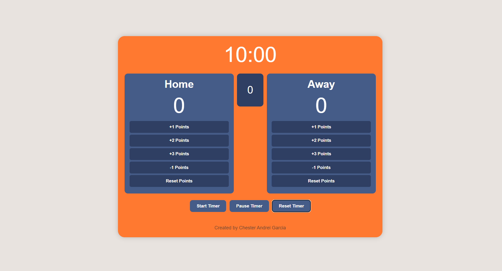

# 🏀 Simple Scoreboard Project

A responsive basketball-style scoreboard built with **HTML**, **CSS**, and **JavaScript**. The app tracks home and away team scores, game quarters, and includes a countdown timer with essential controls — perfect for practice games, mini-tournaments, or coding demos.



---

## 🔗 Live Demo

👉 [Try it here on Vercel](https://scoreboard-chi-seven.vercel.app/)

---

## 📌 Features

- ⏱️ **Countdown Timer**
  - Starts at 10 minutes per quarter
  - Automatically advances to the next quarter when time runs out
  - Ends the game after 4 quarters (with an alert)

- 🏠 **Home and 🆚 Away Team Score Tracking**
  - Buttons to add +1, +2, +3, or subtract -1 point
  - Reset button for each team

- 🧭 **Quarter Tracker**
  - Displays the current quarter (1 to 4)

- 🎮 **Timer Controls**
  - Start, Pause, and Reset functionality

- 📱 **Mobile-Responsive Design**
  - Adapts layout for smaller screens
  - Touch-friendly buttons

- ✍️ **Simple & Clean UI**
  - Basketball-inspired color palette and layout

---

## 🚀 Getting Started

### 1. Clone the Repository

```bash
git clone https://github.com/chesterandreigarcia/Scoreboard.git
```

Or simply [download the ZIP](https://github.com/chesterandreigarcia/Scoreboard/archive/refs/heads/main.zip).

### 2. Open `index.html`

Double-click `index.html` or open it in a browser of your choice to launch the app.

---

## 🛠️ Project Structure

```
Scoreboard/
├── index.html        # HTML structure
├── style.css         # Styles and responsive design
├── script.js         # Logic for scores, timer, and quarter tracking
└── ScreenshotScoreboard.png
```

---

## 📷 Preview


---

## ✒️ Author

Made with ❤️ by **Chester Andrei Garcia**  
Feel free to connect or fork the project and build on top of it.

---

## 📄 License

This project is open-source and free to use for educational and non-commercial purposes. Attribution appreciated.
